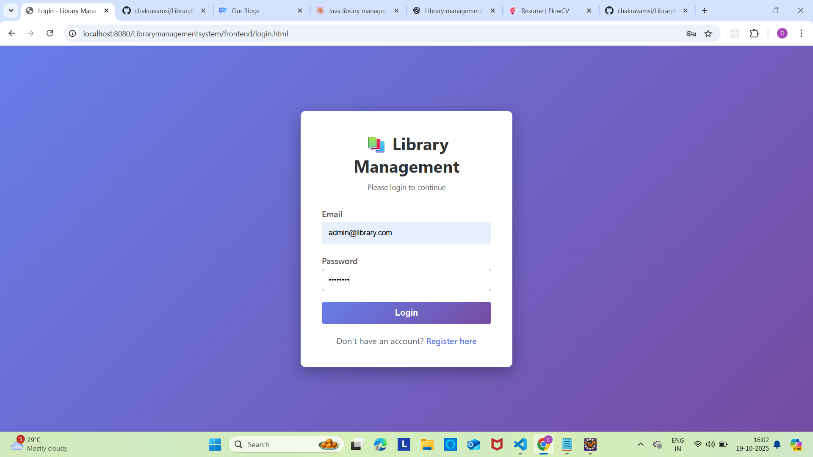
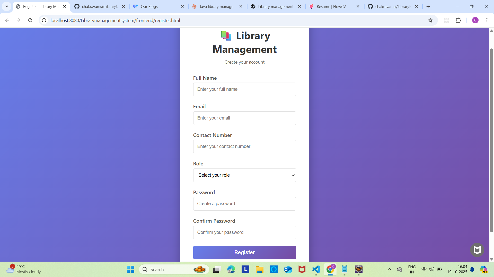
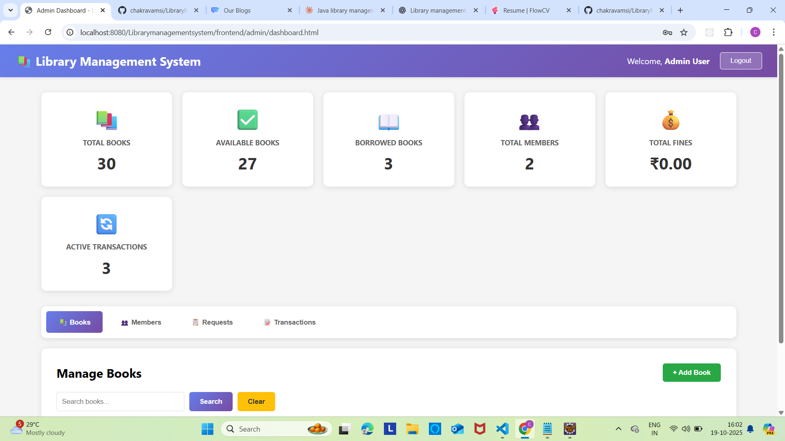
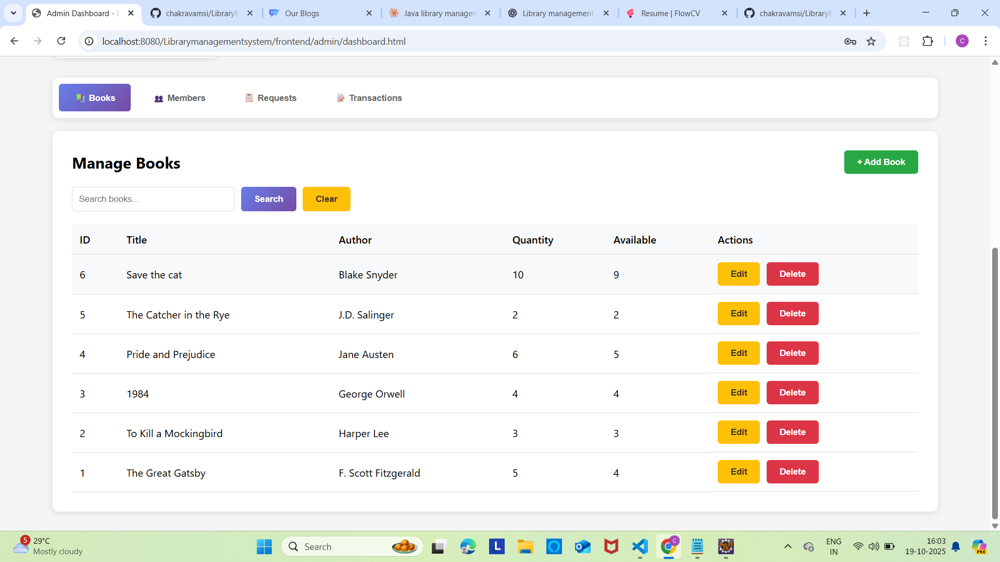
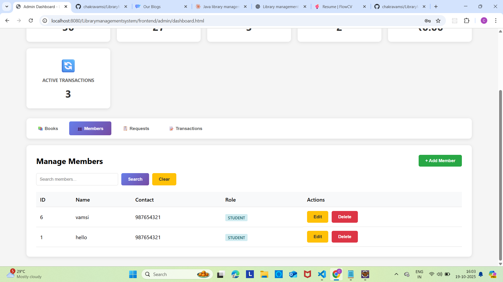
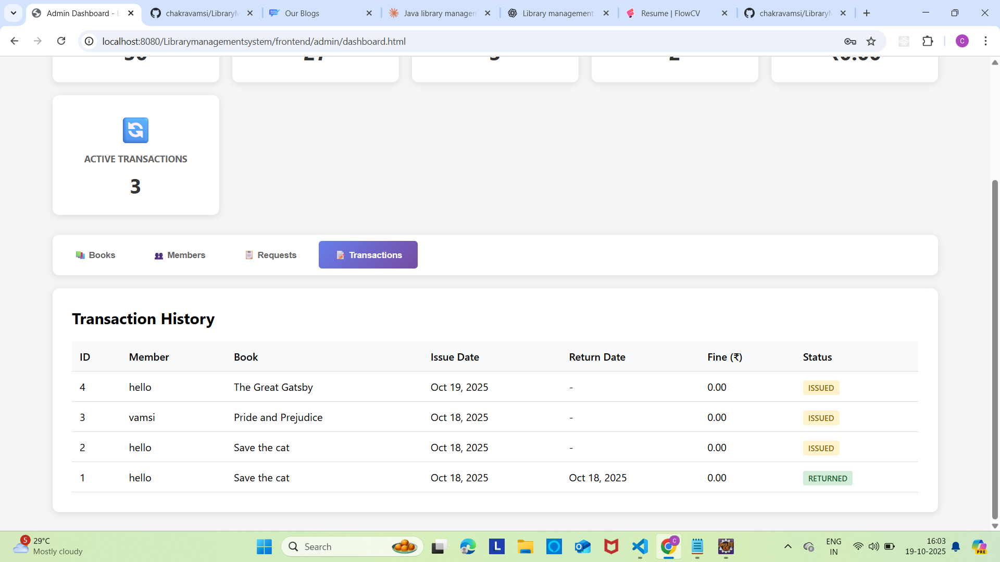
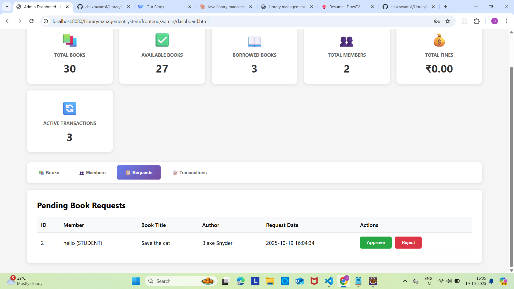
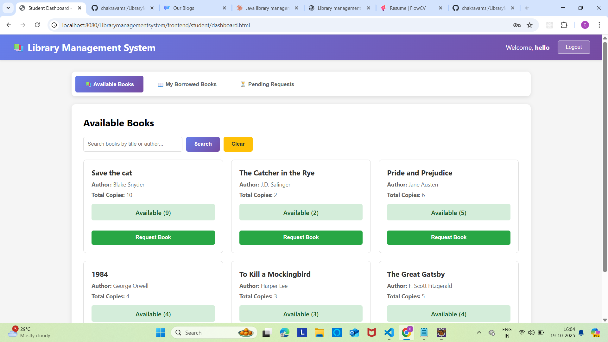
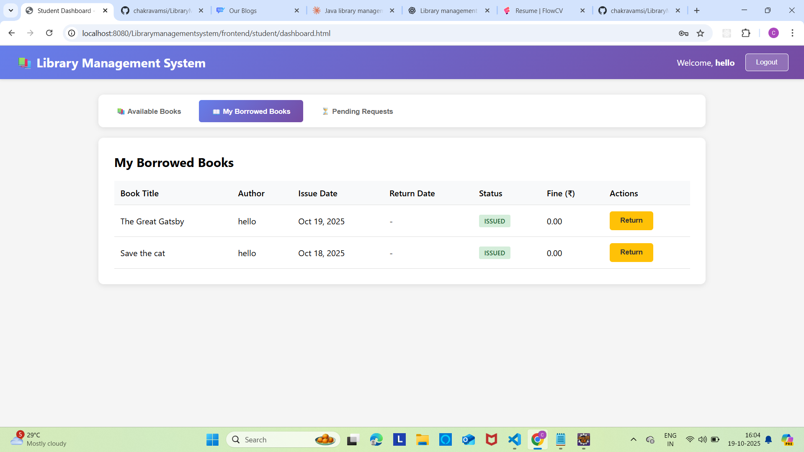
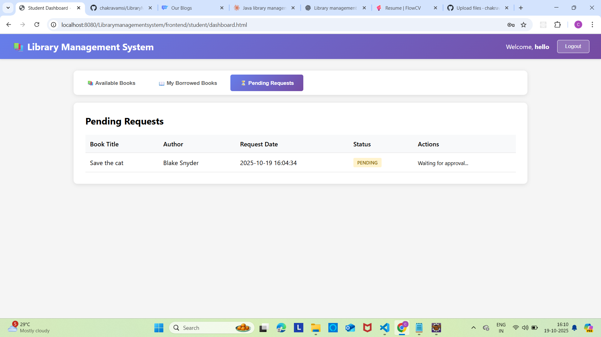

# 📚 Library Management System

A web-based Library Management System built using **Java, Servlets, MySQL, HTML, CSS, and JavaScript**.  
It supports login/registration for **Admin and Student/Staff** roles and manages books, members, issuing/returning, requests, fines, and transaction history.

---

## 🖼️ Project Screenshots

### 🔐 Login & Registration

| Login Page | Registration Page |
|------------|--------------------|
|  |  |

---

### 🧑‍💼 Admin Dashboard

| Dashboard Overview | Book Management |
|--------------------|------------------|
|  |  |

---

### 📚 Book & Member Management

| Add/Edit Book | Manage Members |
|---------------|----------------|
|  |  |

---

### ✅ Book Requests & Transactions

| Book Requests | Transaction History |
|---------------|----------------------|
|  |  |

---

### 👩‍🎓 Student/Staff Panel

| Available Books | My Borrowed Books |
|------------------|-------------------|
|  |  |

---

## ✅ Features

### 👨‍💼 Admin:
- Secure login.
- Dashboard: total books, issued books, members, active transactions, fines.
- Add/edit/delete books & update quantity.
- Add/edit/delete members.
- Search books or members by ID/name.
- Approve or reject book requests.
- View transaction history and fines.

### 👩‍🎓 Student/Staff:
- Registration & login.
- Search and view available books.
- Send book issue requests.
- Track request status: Pending/Approved/Rejected.
- View issued books and due dates.
- Logout securely.

---

## 💡 Fine Policy

| User Type   | Fine Rule                        |
|-------------|-----------------------------------|
| Student     | ₹5 per day after 14 days         |
| Staff       | ₹5 per day after 30 days         |

---

## 🛠 Tech Stack

| Layer       | Technology Used                     |
|-------------|--------------------------------------|
| Frontend    | HTML, CSS, JavaScript (Fetch API)   |
| Backend     | Java Servlets                       |
| Database    | MySQL                               |
| Server      | Apache Tomcat                       |
| Pattern     | MVC (Servlets + DAO + HTML/JS)      |

---

## 📂 Project Structure

